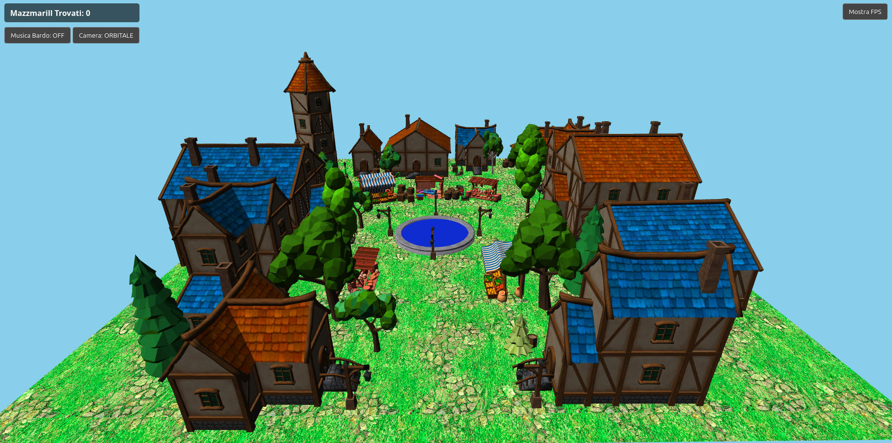

# findthemazzmarill
---
Progetto di grafica 3D sviluppato in WebGL 2.0 per l'esame di Fondamenti Di Computer Graphics della magistrale di ingegneria informatica UNIBO. La scena rappresenta un piccolo borgo medievale in cui si nasconde un folletto dispettoso, il mazzmarill, una creatura appartenente al folklore abruzzese che si diverte nel fare dispetti agli abitanti. Divertiti a cercarlo!
---
### Screenshot del borgo

---
### Demo 
è possibile esplorare il borgo attraverso il seguente link: https://wesl3y01.github.io/findthemazzmarill/
